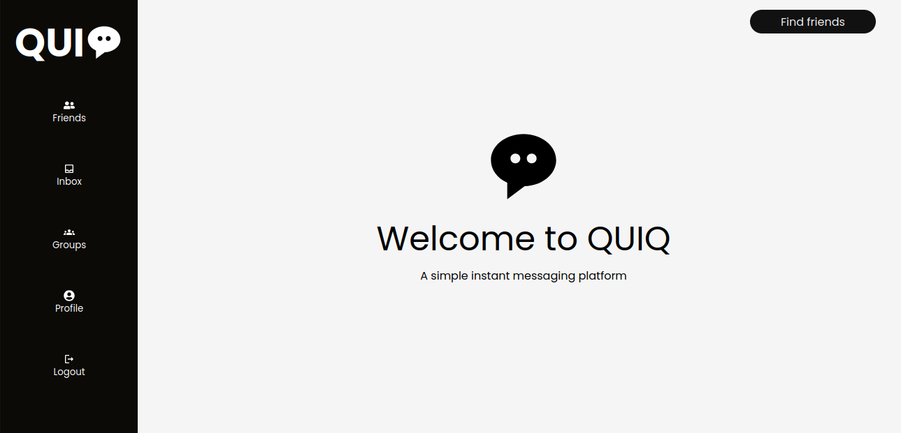
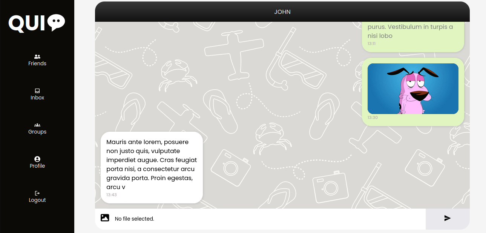

# PERN Messaging App | FRONTEND

A messaging app that uses sockets and REST API architecture, to allow users to send and receive messages.

### Messaging App | Backend

[https://github.com/Lspacedev/messaging-app-backend](https://github.com/Lspacedev/messaging-app-backend)

## Installation

1. Clone the repository

```bash
git@github.com:Lspacedev/messaging-app-frontend.git
```

2. Navigate to the project folder

```bash
cd messaging-app-frontend
```

3.  Install All Dependencies

```bash
npm install
```

4. Create an env file and add the following:

```bash
VITE_PROD_URL="Deployed backend url or localhost"
```

5. Run the project

```bash
npm run dev
```

## Screenshot




## Features

- Authentication: Create a user account.
- Authentication: Login to your account.
- View profile.
- Update profile.
- View user's friends.
- View user's messages.
- View user's groups.
- View user's messages

- Search users.
- Send and recieve messages from and to other users.

## Usage

1. Open the live site in your browser.
2. Login or create an account.
3. Send and receive messages.

## Tech Stack

- ReactJs
- NodeJs
- ExpressJs
- PostgreSQL
- Supabase storage
- Socket.io

## Credits:

```python

<a href="https://www.freepik.com/free-vector/travel-pattern_3792887.htm#from_view=detail_alsolike">Image by freepik</a>

```
